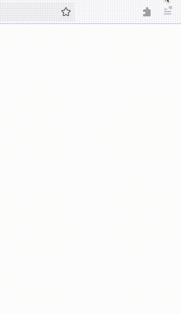
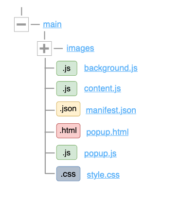
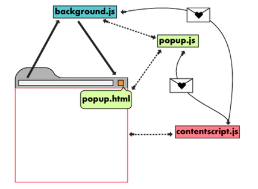

# CS50 Custom Cursor
A chrome extension/Firefox add-on using Javascript, HTML and CSS to customize the mouse cursor with CS50 aesthetics. The following features have been added to the extension
- Different cursors to choose from
- Chosen custom cursor can be used across different tabs

Project video can be viewed [here](https://youtu.be/lSSkriFrkGk)

## Project files

<b>Show Files Description</b>
  

  <ul>
    <li><b>images directory:</b> Contain png images for various cursors</li>
    <li><b>background.js:</b> Monitor user events, then send messages to content.js</li>
    <li><b>content.js:</b> Read and modify the DOM of web pages after exchanging messages with background.js and popup.js</li>
    <li><b>manifest.json:</b> Describes our extension and specify important information like permissions, etc...</li>
    <li><b>popup.html:</b> Opens when user clicks on extension icon in the browser</li>
    <li><b>popup.js:</b> Contains Javascript logic for the extension UI</li>
    <li><b>style.css:</b> Contain the styles of the extension popup</li>
  </ul>

<b>Show How Things Work?</b>
  
 

  
   
1. When users click on a custom cursor from the popup.html, popup.js listens for the clicking event and sends a message to content.js with the name of the chosen cursor. 
   
2. Content.js then modify the css cursor property of the web page, and saves the name of the chosen cursor to the browser storage. 
   
3. Background.js monitor if the user created, updated, activated any tab and again send content.js a message to update the tabs with any change.
  

## Further improvments

- Allow users to add their own cursors
- Add more images and animated cursors
- Add sound that plays when we go to https://cs50.harvard.edu/x
